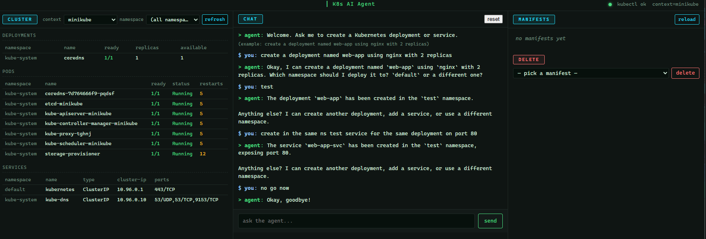

# K8s AI Agent — Web Dashboard

A conversational AI agent for Kubernetes with a built-in web dashboard. Talk to it in natural language to create Deployments and Services, watch your cluster live, view the generated YAML, and delete resources — all from one page in your browser.

Powered by Google Gemini and LangChain. The agent runs `kubectl` against whatever Kubernetes context you pick (minikube, kind, EKS, GKE, AKS, any on‑prem cluster — it doesn't care).



## Features

- **Natural-language agent** — `create a deployment named web-app using nginx with 3 replicas` and it does it
- **Web dashboard** with three panels:
  - **Cluster** — live view of deployments / pods / services, switchable per namespace (or "all namespaces"), auto-refreshes every 10s
  - **Chat** — terminal-style conversation with the agent, session reset, welcome prompt with example
  - **Manifests** — list and preview every YAML file the agent generated under `k8s/`; click a file to view, click again to hide
  - **Delete sub-section** — pick a manifest, click delete → runs `kubectl delete -f` then removes the local file; output auto-hides after 5s (10s on errors)
- **Multi-cluster support** — context dropdown lists every cluster in your kubeconfig; pick any of them and the agent + dashboard target that cluster (`kubectl --context=<picked> ...`)
- **Honest error reporting** — kubectl failures are surfaced verbatim instead of the agent claiming false success; "no cluster reachable" is distilled to a one-line friendly message
- **Auto-bootstrap** — first run creates a per-OS venv (`venv-linux/`, `venv-windows/`, …) and installs all requirements; subsequent runs are instant
- **Auto-open browser** — `python server.py` opens http://127.0.0.1:8000 automatically (Windows / macOS / native Linux / WSL all supported)

## Project Structure

```
K8s-AI-Agent-GUI/
├── agent.py            # AI agent (LangChain + Gemini) + venv bootstrap
├── server.py           # FastAPI backend (web GUI)
├── static/
│   └── index.html      # Dashboard frontend (chat + cluster + manifests + delete)
├── k8s/                # Generated YAML manifests (auto-created)
│   ├── <name>-deployment.yaml
│   ├── <name>-service.yaml
│   └── <namespace>-namespace.yaml
├── kai.bat             # Optional Windows launcher (opens WSL + server)
├── requirements.txt
├── .env                # GOOGLE_API_KEY=... (gitignored)
└── venv-linux/         # Auto-created per OS, gitignored
```

## Requirements

- **Python 3.12+** in PATH
- **`kubectl`** installed and configured with at least one cluster context (`kubectl config get-contexts` should list something)
- **A reachable cluster** (minikube, kind, Docker Desktop K8s, EKS, GKE, on-prem, etc.)
- **A Google Gemini API key** ([get one here](https://aistudio.google.com/apikey))

## Setup

1. **Clone the repository**

   ```bash
   git clone https://github.com/balkanbgboy/K8s-AI-Agent-GUI.git
   cd K8s-AI-Agent-GUI
   ```

2. **Set your Gemini API key** by creating a `.env` file in the project root:

   ```
   GOOGLE_API_KEY=your-key-here
   ```

3. **Run it.** That's it — there's no separate "install dependencies" step.

   ```bash
   # Linux / macOS / WSL
   python3 server.py

   # Windows PowerShell
   python server.py
   ```

   First run creates a per-OS venv and installs ~80 packages (1–3 min on a fast disk). Subsequent runs start in under a second. The dashboard opens in your browser automatically.

## Usage

### Web GUI

`python3 server.py` (or `python server.py` on Windows) → browser opens at http://127.0.0.1:8000.

**Pick the right cluster first.** The `context` dropdown in the **CLUSTER** panel lists every entry from your kubeconfig. Pick the one you want to operate on (e.g. `minikube`). The header shows `context=<name>` so you always know.

**Pick a namespace.** Use the `namespace` dropdown for scoped views, or pick `(all namespaces)` for a cluster-wide view with a namespace column.

**Talk to the agent.** Type `create a deployment named web-app using nginx with 3 replicas` in the **CHAT** panel. The agent will:

1. Ask whether to use `default` or another namespace
2. Generate the YAML, save it to `k8s/`, and `kubectl apply` it
3. If the namespace doesn't exist, create it first
4. Confirm success and ask if you'd like to do anything else

The cluster panel and manifests list refresh automatically after each agent action, so you see the new deployment appear immediately.

**Delete a resource.** In the **MANIFESTS** panel, scroll to the **DELETE** sub-section, pick a manifest from the dropdown, click delete. Confirms first, then runs `kubectl delete -f` against the active context, then removes the local YAML file.

The server listens on `127.0.0.1` only — it's for **personal/local use**, not public hosting.

### CLI (alternative)

If you don't want the web GUI, the same agent runs interactively in the terminal:

```bash
python3 agent.py
```

### Optional Windows launcher (`kai.bat`)

If you're on Windows and run the project via WSL, `kai.bat` opens a WSL window in the project folder and starts `server.py`. To make `kai` runnable from `Win+R`:

```powershell
# One-time: add the project folder to your user PATH (run in PowerShell)
$p = "C:\path\to\K8s-AI-Agent-GUI"
[Environment]::SetEnvironmentVariable("PATH", [Environment]::GetEnvironmentVariable("PATH", "User") + ";$p", "User")
```

After PATH change, close all PowerShell/cmd windows, then `Win+R` → `kai` → Enter.

## Working with any Kubernetes cluster

The app is cluster-agnostic — it shells out to `kubectl` with whatever context you pick. **If `kubectl --context=<name> get nodes` works in your shell, the dashboard will work too.**

### Adding a remote cluster

The exact steps depend on cluster type, but it's all standard kubectl stuff — there's nothing app-specific to configure.

- **EKS**: `aws eks update-kubeconfig --region <region> --name <cluster>` (requires `aws` CLI installed)
- **GKE**: `gcloud container clusters get-credentials <cluster> --region <region>` (requires `gke-gcloud-auth-plugin`)
- **Self-managed (kubeadm on Ubuntu/Debian, k3s, microk8s, etc.)**: copy the kubeconfig from the control plane node (`/etc/kubernetes/admin.conf` for kubeadm, `/etc/rancher/k3s/k3s.yaml` for k3s) and merge it into your local `~/.kube/config`. Update the `server:` URL inside to a reachable IP/DNS.
- **Rancher / managed UIs**: download kubeconfig from the UI and merge.

After adding the context, click **refresh** in the dashboard's CLUSTER panel — it will appear in the dropdown.

### Tool input formats (for the LLM)

The agent uses these tool signatures internally:

**create_deployment**
```
name: <name>, image: <image>, replicas: <n>, namespace: <namespace>
```

**create_service**
```
name: <name>, port: <port>, type: ClusterIP|NodePort|LoadBalancer, namespace: <namespace>
```

You don't usually need to type these — speak naturally and the LLM will fill them in.

## Generated Manifests

Every time the agent creates a resource, the YAML is saved under `k8s/`:

```
k8s/web-app-deployment.yaml
k8s/web-app-service.yaml
k8s/test-namespace.yaml
```

You can re-apply them at any time, completely outside the app:

```bash
kubectl apply -f k8s/
```

Or delete via the dashboard's DELETE sub-section, or manually:

```bash
kubectl delete -f k8s/web-app-deployment.yaml
```

## Configuration

| Variable | Effect |
|---|---|
| `GOOGLE_API_KEY` | Required. Gemini API key. Loaded from `.env`. |
| `NO_BROWSER=1` | Set to skip the auto-open browser on startup (useful when running headless). |

## Dependencies

| Package | Purpose |
|---|---|
| `langchain`, `langchain-core`, `langchain-classic` | Agent orchestration |
| `langchain-google-genai` | Gemini LLM integration |
| `google-generativeai` | Google AI SDK |
| `pydantic` | Data validation |
| `pyyaml` | YAML generation |
| `python-dotenv` | Loads `GOOGLE_API_KEY` from `.env` |
| `fastapi` | Web GUI backend |
| `uvicorn` | ASGI server |

## Security note

This tool runs `kubectl apply` and `kubectl delete` against whatever cluster context is active. It's intended for **personal/local use** where you trust yourself with your own cluster. **Do not expose `server.py` to the public internet** — there is no authentication, and any visitor could deploy or delete anything in your cluster (potentially with LLM-driven prompt-injection attacks).

If you want to share the dashboard, put it behind a private tunnel like Tailscale or Cloudflare Access, or scope its cluster access via a dedicated ServiceAccount with a narrow RBAC role.

## Contributors

- balkanbgboy
